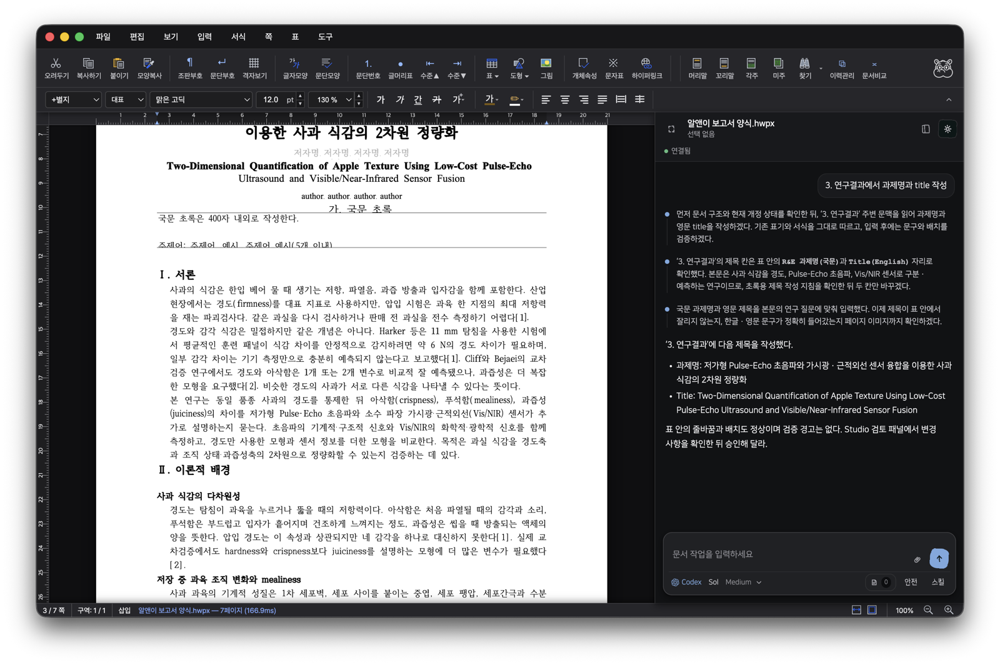

<p align="center">
  
</p>

<h1 align="center">Rauhwpx</h1>

<p align="center">
  An HWP/HWPX editor with an AI agent that edits the document you have open.<br />
  Rust → WebAssembly engine, desktop app and web editor, everything local.
</p>

<p align="center">
  
</p>

## What this is

Korean office work runs on HWP/HWPX, and no AI tool can actually open those files and work inside them. Rauhwpx is a real HWP editor — parsing, layout, rendering and editing all written in Rust and compiled to WASM — with a Claude, Codex or Pi CLI wired directly into the open document through MCP.

The agent reads structure, text ranges, tables, fields and rendered pages, then makes edits you can see and undo. Nothing leaves the machine: the document lives in the browser engine, and the agent hub is a localhost router with no document logic.

## Editor

- **Formats** — HWP 5.0, HWPX and HML read/write, HWP3 read. Roundtrip fidelity is a core contract, backed by ~430 real documents in `rhwp/samples/`.
- **Layout and rendering** — full pagination, 어울림 wrap, tables with page splitting, footnotes/endnotes, equations, shapes, charts and embedded objects, drawn to Canvas2D/CanvasKit in the browser and Skia natively.
- **Editing** — character/paragraph/style dialogs, tables, list numbering, fields and forms, page setup, find/replace, document compare, revision history, undo throughout.
- **Export** — SVG, PNG, PDF, text, Markdown, table dumps, plus HWPX/HML conversion from the CLI.

## Agent sidebar

- **67 MCP tools** — semantic reads and writes for the common work, a batched write that applies up to 32 edits in one atomic call, plus registry-generated engine batches that cover every classified mutation, so the agent is never blocked on a capability the editor has.
- **Live staged edits** — changes render in place as you watch, commit as one undo step when the turn succeeds, and restore the exact prior snapshot when it fails.
- **Two permission modes** — 안전 keeps edits behind review and files inside the project; 전체 lets the agent work uninterrupted.
- **Planning before implementation** — the agent can research with web, subagents and Browserbase while the document stays read-only, then presents a plan that only executes on your approval.
- **Revision contract** — every read returns a revision, every write requires it. Stale writes fail loudly instead of corrupting the document.

## Install

Download a build from [Releases](https://github.com/ghandhitechnology/Rauhwpx/releases): macOS arm64 DMG/ZIP (signed), Windows x64 installer (unsigned for now — SmartScreen warns until we get a certificate).

You supply your own agent CLI. Claude, Codex and Pi can each be installed and signed in from **Settings → Connection** inside the app.

## Development

```sh
cd rhwp && wasm-pack build --target web    # build the engine
cd rhwp-studio && npm install && npm run dev
```

Studio runs at http://127.0.0.1:7700 and owns its own authenticated hub on an ephemeral port, so parallel worktrees never collide. `npm run dev:desktop` from the repo root attaches the Electron shell to that dev server.

For standalone hub work, `npm start` from the root runs it on http://127.0.0.1:5175, logs to `.run/rhwp-agent.log` and returns once ready — `npm stop`, `npm run status`, `npm run start:fg`.

Rust: `cargo test`, `cargo clippy`, `cargo fmt`. Studio: `npm test`, `npm run build`, `npm run e2e:*`.

## Releasing

Push a `v*` tag matching `package.json` and GitHub Actions builds and attaches the installers.

```bash
git tag v0.1.9
git push origin v0.1.9
```

macOS signing uses the `macos-release` environment: `MACOS_CERTIFICATE`, `MACOS_CERTIFICATE_PASSWORD`, `APPLE_ID`, `APPLE_TEAM_ID`, `APPLE_APP_SPECIFIC_PASSWORD`. Local Windows build: `npm run dist:win` on Windows.

## Layout

| Path | What |
| --- | --- |
| `rhwp/src/` | Rust engine — parser, model, document_core, renderer, serializer, wasm_api |
| `rhwp/rhwp-studio/` | Web editor (TypeScript, no framework) and the agent sidebar |
| `rhwp/rhwp-agent/` | Local WS hub bridging the agent CLIs to the open tab |
| `desktop/` | Electron shell — multi-window, per-window agent sessions |
| `rhwp/rhwp-{chrome,firefox,safari,vscode}/` | Browser and VS Code viewer extensions |
| `rhwp/npm/editor/` | Embeddable editor package |

## License

[MIT](rhwp/LICENSE). Independent project — 한글, 한컴, HWP and HWPX are Hancom trademarks, and this is not affiliated with or endorsed by Hancom.
