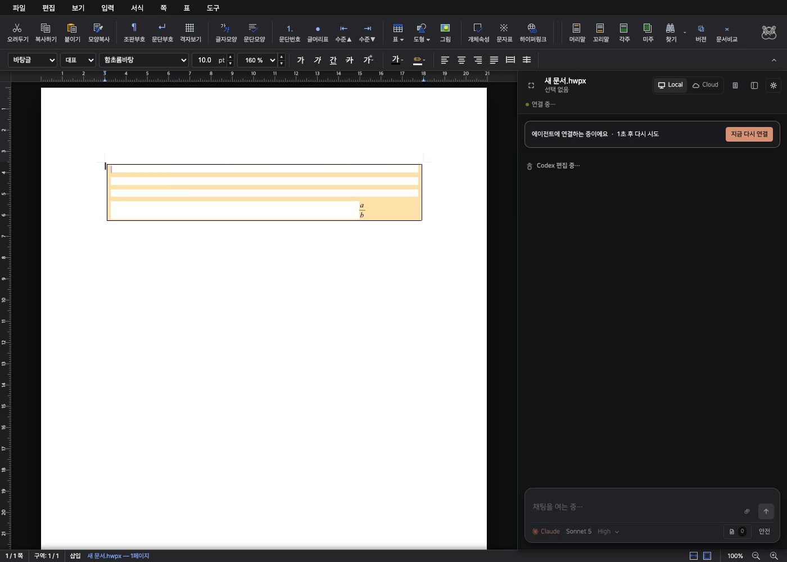
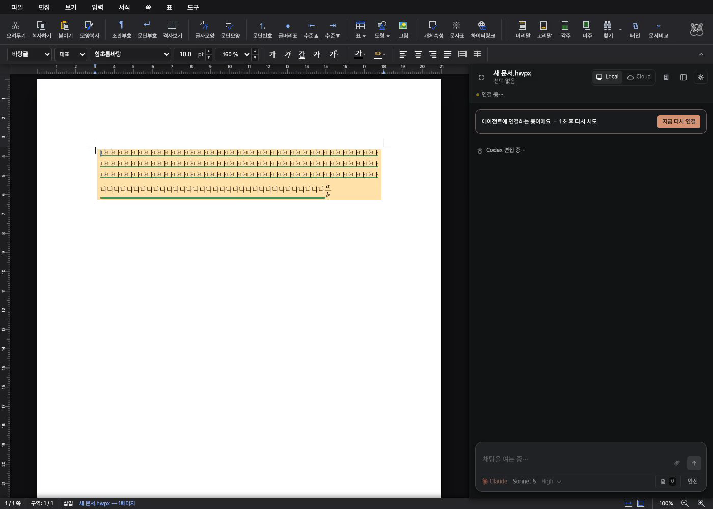
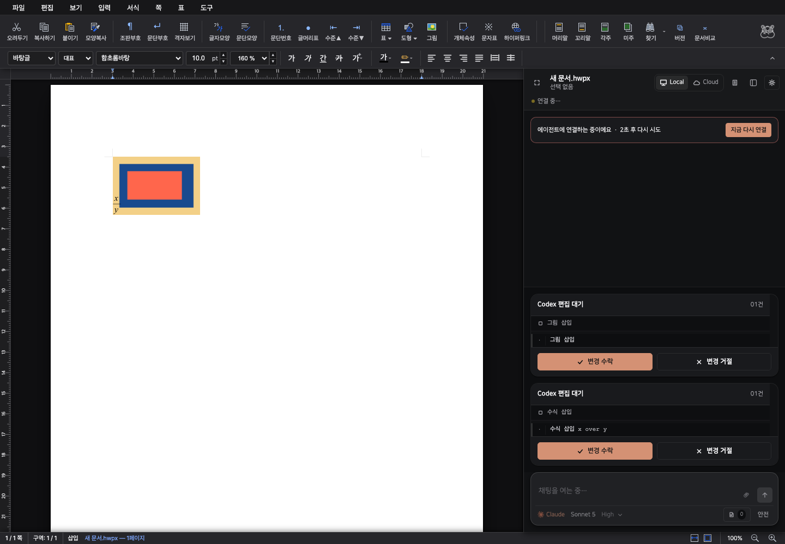
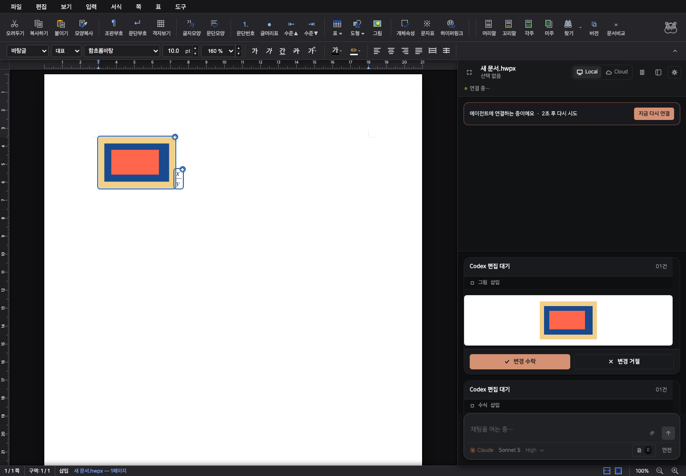
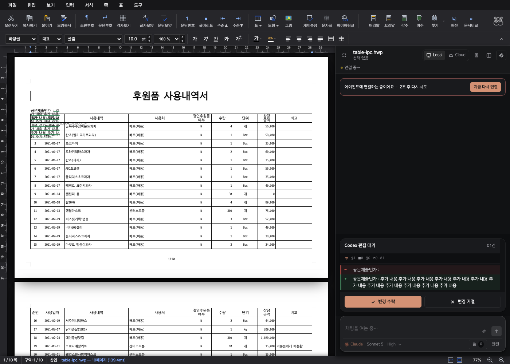

# Agent preview integrity

This change builds on the rendering work in PR #344. The browser checks run real pending edits against the production WASM engine without requiring a connected model provider.

## What changed

- Pending edits use underlines, object outlines, and a moving caret. They no longer paint white reveal covers or blend a tint over document pixels.
- Text replacement preserves character style runs. Image and equation rejection restores the original layout snapshot when safe, with local inverse operations retained for intervening edits.
- Table remeasurement keeps its loaded row allocation and adds measured content growth. Small edits preserve saved page boundaries and text positions.
- Images and equations have exact outlines, including nested cell equations, and rendered thumbnails in review cards. Inline images reserve their width before following equations.

## Results

The final browser corpus passed **20 documents, 167 tables, and 10,103 cells**. Three focused basic, merged, and nested table fixtures passed separately. Fresh loads of all 20 corpus documents matched pre-fix page counts, table and object rectangles, and raw text-layout hashes exactly. The final [machine report](report.json) records all 20 results.

The original uploaded physics document passed the same lifecycle and visible text checks. [Physics document during review](physics-pending.png). Its one-character header replacement is a synthetic layout test; the uploaded source file was not modified.

| Document | Pages | Tables | Cells | Result |
| --- | ---: | ---: | ---: | --- |
| `table-complex.hwp` | 4 | 4 | 352 | Pass |
| `multi-table-001.hwp` | 2 | 6 | 1129 | Pass |
| `multi-table-002.hwp` | 2 | 6 | 1129 | Pass |
| `hwp_table_test.hwp` | 3 | 10 | 110 | Pass |
| `hwp_table_test-m.hwp` | 3 | 10 | 109 | Pass |
| `table-001.hwp` | 1 | 1 | 131 | Pass |
| `table-004.hwp` | 1 | 1 | 86 | Pass |
| `inner-table-01.hwp` | 2 | 1 | 14 | Pass |
| `issue-986-receipt.hwp` | 1 | 7 | 323 | Pass |
| `pic-in-table-01.hwp` | 22 | 47 | 269 | Pass |
| `issue2004_cell_image_stack.hwp` | 8 | 7 | 121 | Pass |
| `exam_math.hwp` | 20 | 16 | 25 | Pass |
| `task2146/21761835_jeonjik_exemption_table.hwp` | 6 | 1 | 296 | Pass |
| `task2319/20544835_jinan_apt_form.hwp` | 2 | 5 | 105 | Pass |
| `task2322/20862337_cheongyang_voucher_form.hwp` | 2 | 2 | 69 | Pass |
| `task2322/19439117_gokseong_voucher_form.hwp` | 2 | 2 | 69 | Pass |
| `issue2439/issue2439_repeat_table_overlap.hwp` | 10 | 24 | 3156 | Pass |
| `hwpx/form-002.hwpx` | 10 | 5 | 430 | Pass |
| `table-ipc.hwp` | 10 | 11 | 1739 | Pass |
| `21868765_별표2_보건소_분장사무.hwp` | 4 | 1 | 441 | Pass |

## Visual evidence

| Scenario | Before | After |
| --- | --- | --- |
| Live edit in a colored table |  |  |
| Image and equation insertion |  |  |
| Long edit near another table |  |  |

[Next page of the grown table](table-growth-continuation.png) · [Long table after pagination](overflow-after.png) · [Its continuation](overflow-continuation.png)

[Equation review card](equation-review.png) · [Nested equation preview](nested-equation.png)

[Before recording](../agent-table-reveal/before-animation.mp4) · [After recording](../agent-table-reveal/after-animation.mp4)

The table images are frames at 0.18 seconds from real browser recordings. The object baseline was captured using the original production UI from commit `50d3eb57` in a detached worktree. The after images show the changed production UI.

## Reproduce

Start the studio on port 7701 after building WASM, then run from `rhwp/rhwp-studio`:

```sh
export export VITE_URL=http://127.0.0.1:7701
export CHROME_PATH='/Applications/Google Chrome.app/Contents/MacOS/Google Chrome'
node e2e/agent-preview-integrity.test.mjs --mode=headless
node e2e/agent-preview-report.mjs
PREVIEW_INTEGRITY_ARTIFACTS=../../../output/e2e/agent-preview-integrity-targeted \
  node e2e/agent-preview-integrity.test.mjs --mode=headless --targeted
PREVIEW_INTEGRITY_ARTIFACTS=../../../output/e2e/agent-preview-integrity-baseline \
  node e2e/agent-preview-integrity.test.mjs --mode=headless --baseline-only
```

The manifest lists the 20 documents. Each case checks a cell replacement during streaming and review, approval, a longer edit and rejection, and equation insertion and rejection. Two image-heavy documents also check image insertion and rejection. Assertions cover all cell text and structure, every rendered control fragment, unrelated visible text positions and styles, the new equation inside its own cell, no new sibling table or body object overlap, no new page overflow, and exact restored text layouts. Repeated table headers are checked by object identity and rendered fragments.

Run `--only=<sample-relative-path>` for one document. The report generator creates an HTML contact sheet with links to full resolution stage captures. The `--baseline-only` run records page, control, and text-layout signatures for comparison with a saved baseline.
