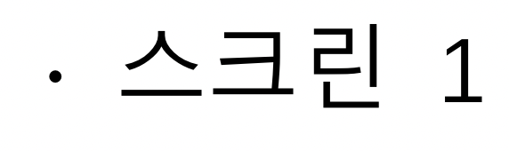
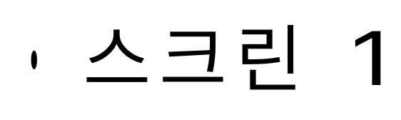
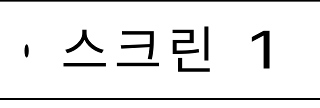
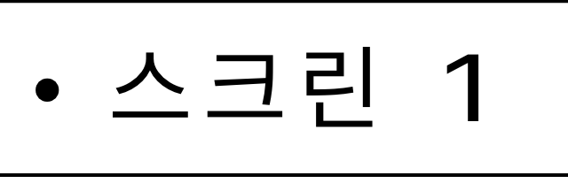
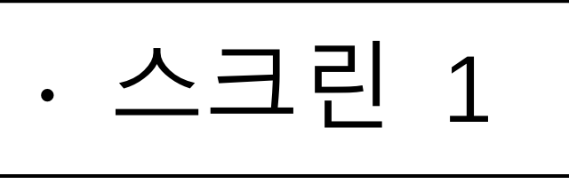

# Preserve substitute symbol proportions

The physics worksheet stores U+2219 `∙` in Malgun Gothic. Its saved advance is 4.187 px at a font size of 13.333 px. When that face is unavailable, the browser substitutes a glyph with an advance of about 12.93 px. Canvas 2D fitted that advance by scaling only the horizontal axis, turning the circular dot into a tall ellipse.

This reproduces with local HCR Dotum imported while Malgun Gothic is missing. Importing the actual Malgun Gothic face already renders the correct native dot. Loading a local font does not guarantee that every requested document face is present.

The correction uses visible ink bounds when an isolated mathematical or geometric symbol needs fallback fitting. It centers the ink within the saved advance and scales both axes together when necessary. Authored character-width scaling remains separate. The source text, character advances, line breaks, and page layout are preserved. Plain text and text effects use the same calculation.

Exact glyph design still comes from the selected font. The fallback correction preserves its proportions; the original Malgun Gothic face supplies the official editor's dot size and outline.

## Visual evidence

User-provided official reference:



User-reported rendering before the correction:



### Original document at native 8× resolution

Local HCR Dotum is imported in both fallback captures; Malgun Gothic is unavailable.

| Before | After | With actual Malgun Gothic |
| --- | --- | --- |
|  |  |  |

The fallback dot changes from **9×26 px** to **26×26 px**. The actual Malgun Gothic dot is **14×14 px**, and its reference crop is pixel identical before and after the change. The fallback correction fixes distortion; it does not claim to reproduce a missing font's exact glyph size.

## Verification

- `cargo test --manifest-path rhwp/Cargo.toml --lib renderer::text_replay_policy::tests -- --nocapture`: 9 tests passed. These cover wide side bearings, proportional shrinking, authored width ratios, invalid bounds, unchanged matching-font geometry, negative letter spacing, and run-shaping policy.
- `cargo check --manifest-path rhwp/Cargo.toml --target wasm32-unknown-unknown --lib`: passed.
- `wasm-pack build --target web` in `rhwp`: passed.

The browser regression uses a small synthetic HWPX fixture with an authored Malgun Gothic advance. It does not require the private physics document or distribute commercial fonts.


- Browser regression `symbol-fallback-rendering.test.mjs`: passed on the rebuilt WASM. It forces the bundled web substitute, verifies that the substituted advance actually exceeds the source advance, and checks the dot's proportions from painted pixels at native 8× resolution. The original build failed the same dot-aspect assertion.
- Original physics HWP: all four pages load. The affected first-page runs retain their saved bboxes and character positions, including the dot before `스크린`: x=419.56, y=322.787, positions=[0, 4.187, 10.853].
- Original physics HWP with actual imported Malgun Gothic: the reference crop is byte-identical to its pre-change capture.

```sh
VITE_URL=http://127.0.0.1:7741 \
CHROME_PATH='/Applications/Google Chrome.app/Contents/MacOS/Google Chrome' \
node rhwp/rhwp-studio/e2e/symbol-fallback-rendering.test.mjs --mode=headless
```

Ship the rebuilt WASM with the frontend. Save open documents before reloading the editor. Mathematical/geometric symbols in mixed text runs use the existing positioned-cluster path so whole-run width fitting cannot distort them; ordinary letter-only shaping retains its current behavior.
