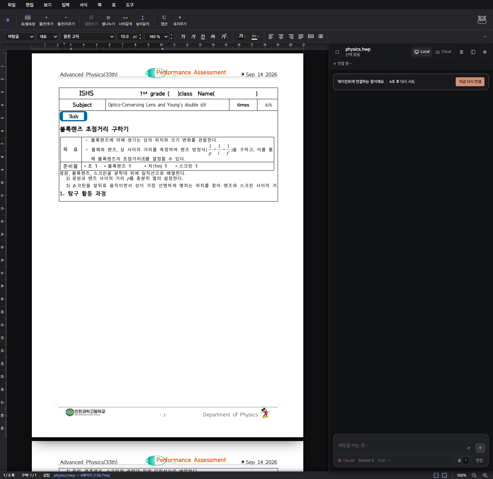

# Table clipboard integrity

Reproduction uses the physics assessment HWP supplied in the issue. Select the three instructions under “탐구 활동 과정”, copy, and paste into the blank paragraph above that heading. Separately, select only “스크린” in the nested preparation table and copy it.

## What broke

- Nested text copy used the outer cell paragraph, copying an enclosing table instead of the selected word.
- Cell paste retained paragraph positions from the source and cached line ranges from before insertion. This introduced false page breaks and hid wrapped lines.
- Body paste treated a selection containing an image as a single object and omitted later paragraphs.
- Text offsets disagreed with cursor offsets around inline objects. Copy could skip the first selected character; paste could use the wrong insertion position.
- Failed copy could still delete the selection during cut.

## Changes

Resolve clipboard selections using the full cell path and use logical cursor offsets for clipping and insertion. Preserve paragraph metadata, inline equations, image bytes, and the destination suffix. Recalculate cell paragraph positions and invalidate cached table line ranges after paste. Use the object-only body paste path only for a single supported object. Select-all includes inline object slots in its endpoint. Cut requires a successful copy.

Copying a range across multiple separate cells remains unsupported. The editor now reports that limitation and preserves the selection rather than copying an unrelated enclosing table.

## Visual evidence

Both captures use the same HWP, Chrome viewport, and bundled font configuration. The baseline runs commit `4aed1f14` with its original frontend and WASM. Recordings show selection, copy, paste, undo, and redo through production clipboard handlers.

| Before | After |
| --- | --- |
|  |  |

[Before recording](before.mp4) · [After recording](after.mp4) · [Page continuation](continuation.png) · [Equation/image fixture](objects.png)

## Verification

Final original-document checks passed: selecting “스크린” copies only that word, all seven previously clipped paragraphs remain fully rendered, and undo/redo restore identical text and rendered text runs. All five pages after insertion were inspected. The original 103 cell paragraphs become 105 after replacing one blank paragraph with the three copied paragraphs.

The 18 focused frontend tests, TypeScript checks, native clipboard/field/picture/nested-paste suites, release WASM build, and browser clipboard-priority regression passed. The native cache regression also fails when cache invalidation is removed.

The browser regression uses generated fixtures, with no dependency on the private HWP:

```sh
cd rhwp/rhwp-studio
CHROME_PATH='/Applications/Google Chrome.app/Contents/MacOS/Google Chrome' \
VITE_URL=http://127.0.0.1:7741 \
node e2e/table-clipboard-integrity.test.mjs --mode=headless
```

It covers nested text and table selection, multi-paragraph paste, body-to-cell text, external HTML, mixed equations and images, individual object copies, cell-to-body paste, inline equation boundaries, sibling preservation, and undo/redo.

Native tests cover character styles, tabs, range tags, inline anchors, image data, equation scripts, invalid-target atomicity, and cached versus fresh rendering of wrapped table text. Frontend tests cover nested routing, clipboard provenance, and failed-copy cut protection.
