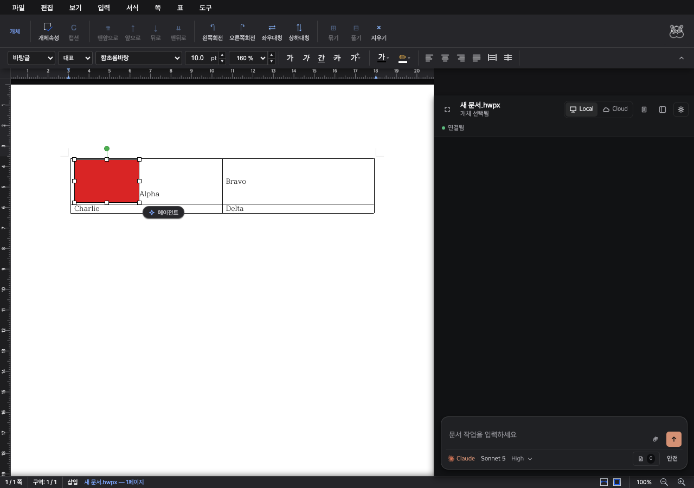
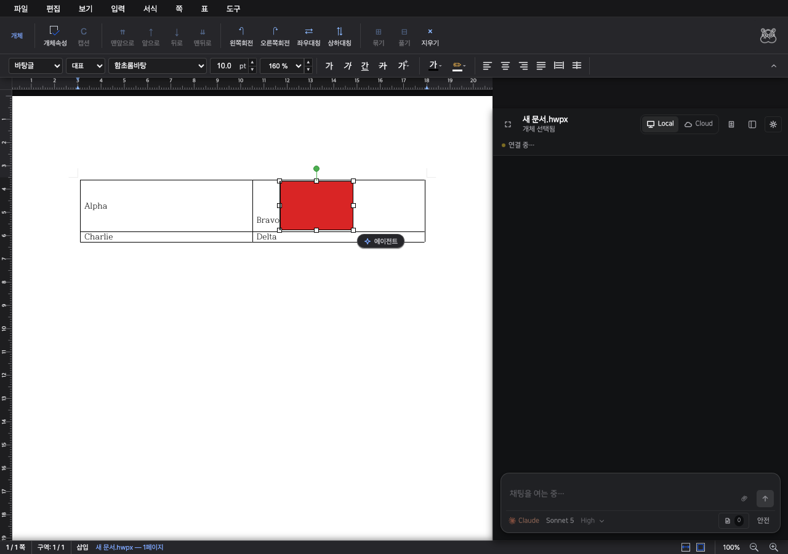

# Dragging images inside tables

Inline images in table cells were excluded from the mouse drag path, and the move command only addressed body paragraphs. A first press selected an image without starting its drag.

The shared drag initializer now starts selection and dragging on the same press, with a three-pixel movement threshold. A path-aware native command moves inline images between body paragraphs and nested table cells, preserves image data and paragraph metadata, and reflows the affected tables. Cell moves use document snapshots for undo/redo.

## Evidence

Both recordings press the image directly and drag to the visible center of the neighboring cell. The test recalculates that center after the contextual toolbar changes the editor position.

| Before: image stays in its original cell | After: image moves to the destination cell |
| --- | --- |
|  |  |

[Before recording](before.mp4) · [After recording](after.mp4)

The baseline serves the frontend modules from `c57aaa99` alongside the rebuilt native WASM. The fixed recording uses the updated frontend and the same WASM. The baseline fails the destination-cell assertion; the fixed build passes.

## Verification

- `cargo test --manifest-path rhwp/Cargo.toml --test move_inline_picture -- --nocapture`: 10 tests passed, covering metadata retention, same-cell ordering, nested cells, body/cell moves, and invalid destinations.
- `wasm-pack build --target web` in `rhwp`: passed.
- `npx tsc --noEmit` and `npm run build` in `rhwp/rhwp-studio`: passed.
- `e2e/drag-table-image.test.mjs`: passed using real browser mouse events. Checks image byte identity, exactly one image, unchanged text in every cell, image containment, undo/redo, and second-row growth.
- `e2e/drag-inline-image.test.mjs`: passed, including a selection click that must not move the image and body drag undo/redo.

Run the browser tests from `rhwp/rhwp-studio` with a running studio and its rebuilt WASM:

```sh
VITE_URL=http://127.0.0.1:7741 CHROME_PATH='/Applications/Google Chrome.app/Contents/MacOS/Google Chrome' node e2e/drag-table-image.test.mjs
VITE_URL=http://127.0.0.1:7741 CHROME_PATH='/Applications/Google Chrome.app/Contents/MacOS/Google Chrome' node e2e/drag-inline-image.test.mjs
```

Deploy the new WASM module with the frontend. Reload an already open editor after saving the document to load the updated engine.
