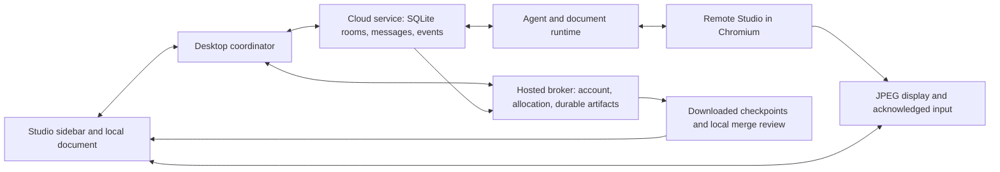

# Raucloud research and design review

Research date: September 20, 2026. Source revision: `8ea152e7a0e4b681ac3faae83d632c5f14fd4d5b`.

## Recommendation

Make the cloud experience revolve around a document task and its changes. A user should be able to send work, leave, return to a recognizable task, and review a saved result. Server management should occupy a secondary settings surface.

The current implementation already has durable conversations, replayable events, verified document checkpoints, recovery after worker replacement, automatic result retrieval, and document merge review. Preserve that work. The next investment should address the remaining durability boundaries, simplify the interaction model, and reduce the amount of state transferred on the critical path.

My strongest UI criticism is that the interface gives infrastructure more prominence than work. My strongest technical concern is that full document/history persistence passes through a shared broker bottleneck. A visual redesign and these backend repairs belong in the same program of work.

## What this review establishes

I inspected current application source, historical reliability work, and official documentation from Cursor, Devin, OpenAI, and Anthropic. I also ran the production sidebar through its local preview and inspected dashboard, expanded settings, active-task controls, narrow disconnect recovery, provider selection, and first cloud submission. The preview uses mock services and document content. Its screenshots establish UI behavior, not hosted execution performance.

A small in-memory probe using the production artifact implementation reproduced the full-storage cleanup failure described below. I did not contact production infrastructure, benchmark live provider latency, or run the full regression suites. No application code was changed.

Vendor documentation establishes published behavior. Cursor's engineering post describes its own architecture. These sources do not provide a comparable, independently measured reliability ranking across the four products.

## What to learn from the other products

| Product | Supported finding | Useful adaptation for Raucloud |
| --- | --- | --- |
| Cursor | Its published architecture separates the agent workflow, machine lifecycle, and conversation storage. It moved execution to Temporal and uses retry-aware conversation streaming. | Give a task a stable identity across reconnects, worker replacement, and execution attempts. Keep the client able to inspect saved work while compute is unavailable. [Engineering account](https://cursor.com/blog/cloud-agent-lessons) |
| Cursor | Builds prepare environments before runs, retain the latest successful build when a new build fails, and support prewarmed execution. | Prepare the engine, fonts, Chromium, and provider tools ahead of requests. Track the tested runtime build used by a task. [Builds](https://cursor.com/docs/cloud-agent/builds) |
| Devin | A unified Progress view links activity to command output and edits. Read-only side chats let users ask about a session without changing its work. | Show document activity with expandable evidence. Give a status question different semantics from an editing instruction. [Session tools](https://docs.devin.ai/work-with-devin/devin-session-tools) |
| Devin | Environment blueprints produce snapshots with build status, verification, latest-successful selection, and pinning. | Treat a working document environment as a release artifact. Failed font or engine updates should leave the working release available. [Blueprints](https://docs.devin.ai/onboard-devin/environment/blueprints) |
| Codex | Cloud tasks run in isolated environments and return a summary, logs, and a diff for review and follow-up. | Make the saved document result and review flow the central destination. [Codex cloud](https://learn.chatgpt.com/docs/cloud) |
| Claude | Managed cloud sessions continue independently of the laptop. Its documentation distinguishes them from Remote Control, which executes on the user's machine. | Keep the promise of managed Cloud clear. Put self-hosted connection details in settings and explain remote-device availability when that mode is selected. [Cloud](https://code.claude.com/docs/en/claude-code-on-the-web), [Remote Control](https://code.claude.com/docs/en/remote-control) |

Cursor's most transferable lesson is architectural. Its workflow engine can manage machine changes independently, while conversation storage handles retries that replace partially streamed output. Raucloud should adopt those guarantees incrementally. A Temporal migration needs evidence that the existing database and worker leases cannot support the required recovery behavior economically. [Cursor engineering](https://cursor.com/blog/cloud-agent-lessons)

Devin also publishes a useful queue contract for its self-hosted Outposts: list queued work, watch from the returned cursor, tolerate duplicate delivery, claim atomically, and release or expire failed claims. This is evidence about Outposts, not a description of Devin's private hosted scheduler. Raucloud can use the same ownership principles when provisioning fails. [Outposts orchestration](https://docs.devin.ai/cloud/outposts/orchestration)

Codex documents environment caching and separate setup/maintenance work. Claude also caches successful filesystem setup while recreating processes. The corresponding Raucloud cache should contain runtime dependencies, with user documents and credentials supplied separately. [Codex environments](https://learn.chatgpt.com/docs/environments/cloud-environment), [Claude environments](https://code.claude.com/docs/en/cloud-environments#environment-caching)

Claude's documented cloud recovery has limits: a fresh VM can restore conversation history after expiry while unfinished shell commands and background processes are gone. Its terminal/cloud handoff also has explicit copy semantics. Raucloud needs to communicate the latest saved document boundary just as clearly. [Cloud recovery and handoff](https://code.claude.com/docs/en/claude-code-on-the-web)

These products also support substantial remote inspection and control. The document-specific recommendation here is to make native document reading and review the default, while retaining remote control as a useful secondary tool.

## Current system and the foundation to keep



This diagram summarizes the managed desktop path. The browser client uses its own transport adapter, and self-hosted services have different provisioning and isolation. Sources: [service contract](../cloud/README.md), [desktop coordinator](../desktop/cloud-coordinator.mjs), [browser adapter](../rhwp/rhwp-studio/src/cloud/browser-cloud.ts).

The current source already supports important behavior that older design documents describe as missing:

- Initial handoff receives a durable acknowledgement before the UI says the laptop can close. Follow-up delivery has separate pending/durable state. [Handoff display](../rhwp/rhwp-studio/src/ui/agent-sidebar/cloud-ui.ts#L1017)
- Separate local conversations can edit the retained local copy while Cloud keeps its own document lease. [Editor scope](../rhwp/rhwp-studio/src/cloud/editor-scope.ts#L5)
- Downloaded cloud changes can be reviewed against concurrent local changes. [Merge review](../rhwp/rhwp-studio/src/ui/agent-sidebar/cloud-ui.ts#L844), [version merge coverage](../rhwp/rhwp-studio/tests/cloud-version-merge.browser.test.ts)
- Desktop notifications already announce prefetched results. Their click currently focuses a window, rather than opening the producing task. [Notification implementation](../desktop/main.mjs#L569)
- Input batching, application receipts, retained frames, signed inline JPEGs, and reconnect safeguards have already repaired earlier failure modes. [Recorded fixes](raucloud-reliability-fixes.md), [later UX audit](cloud-editing-ux-audit.md)

## UI critique

### The information hierarchy needs to change

At the normal sidebar width, the dashboard first shows an illustration, a heading, connection status, a large quota card, a Cloud-box count, and a usage chart. The conversation list is below that. Even the expanded dashboard spends its initial viewport on these statistics. The user looking for a finished task has to scroll past information that cannot help them open it.

The conversation rows themselves have no navigation or task actions. They are static list items. A visible document name strongly suggests that it can be opened; the implementation does not fulfill that expectation. [Dashboard rendering, lines 338–359](../rhwp/rhwp-studio/src/ui/agent-sidebar/cloud-dashboard.ts#L338)

Evidence: [sidebar dashboard](evidence/cloud-research-2026-09-20/dashboard.png), [expanded dashboard](evidence/cloud-research-2026-09-20/dashboard-expanded.png).

### Active work hides its controls behind an ambiguous symbol

Once a cloud conversation starts, the execution selector becomes an icon. That icon opens a panel containing a second instruction field and six actions: redirect, pause, continue locally, end conversation, save a completed copy, and force-stop the server. Most receive similar visual weight. Two destructive actions are present during ordinary work.

The system has legitimate reasons for these operations. The user should encounter them at the moment they are useful. The present panel asks the user to understand the runtime's state machine before choosing a button. [Task actions](../rhwp/rhwp-studio/src/ui/agent-sidebar/cloud-ui.ts#L1080)

Evidence: [active conversation](evidence/cloud-research-2026-09-20/working.png), [opened action panel](evidence/cloud-research-2026-09-20/task-controls.png).

### Status language can contradict the visible situation

The disconnected preview shows a green "연결됨" near the header and "Cloud 연결이 끊겼습니다" above the composer. The indicators refer to different connections, but the interface does not identify their scope. A user should not have to infer which subsystem the green dot describes.

Recovery also places "다시 연결" and "서버 다시 만들기" directly in the composer area. The latter asks an ordinary user to choose an infrastructure operation. Show one recovery action first. Offer a replacement environment only after the system has identified that need and verified the saved revision it will restore.

Evidence: [narrow recovery state](evidence/cloud-research-2026-09-20/recovery-narrow.png). The preview was configured for 360 px and the inspected recovery sidebar measured 280 px. This is a narrow-layout observation, not proof of a production window-resize defect.

### First use exposes a compatibility problem too late

In the inspected setup scene, choosing Cloud with Rau selected produced a transcript message listing five supported providers. It offered no direct provider-selection action in that message. Choosing Codex and submitting then worked in the fixture, while the earlier unsupported-provider message remained in the conversation.

Put this repair beside the execution choice: "Cloud에서 사용할 AI를 선택하세요" with the configured supported providers. Keep setup failures out of the permanent document conversation unless they affected a submitted task. Preserve the user's draft and require their choice before changing provider. [Provider compatibility](../rhwp/rhwp-studio/src/cloud/cloud-start.ts#L15), [observed provider block](evidence/cloud-research-2026-09-20/provider-block.png).

### Progress currently promises precision the system does not have

Reconnect/rebuild progress uses an exponential curve, initial estimates of nine and 75 seconds, and a 96% cap. The source explicitly says these operations have no intermediate progress reports. The UI then displays an approximate countdown that becomes "마무리 중" when the estimate expires. That can imply a finishing stage while the system is still waiting for provisioning. [Estimate model](../rhwp/rhwp-studio/src/ui/agent-sidebar/cloud-link-estimate.ts), [display](../rhwp/rhwp-studio/src/ui/agent-sidebar/cloud-link-progress.ts#L47)

Show the actual stage and elapsed time. Use a byte-based progress bar for known uploads. Use a quiet activity indicator for uncertain provisioning. Display a time range only when measured history supports it, and stop presenting that range after it becomes stale. The onboarding copy currently allows up to 30 minutes; that is a configured wait allowance, not a measured typical startup time. [Onboarding](../rhwp/rhwp-studio/src/ui/agent-sidebar/cloud-onboarding.ts#L834)

### Element-by-element disposition

Every visible element should identify the current work, navigate useful content, enable an action, or explain a decision. Brand identity can have a purpose, but should not displace the user's task.

| Current element | Decision | Purpose in the proposed UI |
| --- | --- | --- |
| Large cloud illustration | Shrink; reserve larger artwork for the empty state | Recognize Cloud without taking space from active work. |
| "Cloud 관리" heading and explanatory subtitle | Replace in the main destination with "Cloud 작업" | Tell people they can find and open work here. |
| "1 / 1 Cloud boxes" card | Remove from the ordinary experience | The supported single allocation does not create a useful comparison or decision. |
| Large remaining-minutes card | Reduce to a compact account summary | Let people know whether they can start or continue. Expand near exhaustion. |
| Seven/30-day usage chart and data table | Move to Usage settings | Support cost investigation without displacing task navigation. |
| Server host, region, protocol and runtime version | Move to connection details | Support self-hosted setup and troubleshooting. |
| Several separate connected indicators | Replace with one context-specific status | Explain the selected task's actual availability. |
| Last refresh time and manual refresh | Put in details; surface staleness when relevant | Establish freshness without asking users to maintain the UI. |
| Static conversation rows | Make navigable and keyboard accessible | Open the task, latest saved result, and outstanding question. |
| Generic document names in task lists | Add a short task title, retain document subtitle | Distinguish several tasks on the same proposal. |
| Local/Cloud execution choice | Keep at task creation; show a labeled badge afterward | Make execution location predictable without implying live migration. |
| Icon-only Cloud state button | Replace with a labeled task status and overflow | Make running, waiting, and recovery visible without opening a popover. |
| "선택 없음" when there is no selection | Hide the empty selection row | Show selection context when the prompt actually references it. |
| My document/Cloud document floating controls | Move beside the document view they change | Distinguish document versions from execution location. |
| Review button beside those controls | Place with the completed result; keep a persistent review entry | Take the user directly to the saved changes. |
| Turn number in "Cloud 변경 검토 · 1턴" | Replace with task/result information | Show what changed; retain turn and revision numbers in details. |
| Second redirect textbox in the status panel | Consolidate into the composer | Offer "다음 작업으로 보내기" and "현재 작업 수정" with clear, distinct effects. |
| Pause control | Keep while running | Stop at a saved boundary without ending the conversation. |
| Continue on this device | Keep in task overflow | Perform an explicit transfer when the user wants local execution. |
| End conversation | Rename by effect and move to overflow | Explain whether it stops work, closes a task, or archives history. |
| Force-stop server | Move to advanced recovery | Make destructive infrastructure intervention exceptional. |
| Save completed copy during active work | Label "저장된 사본 다운로드" and attach to the result | Identify exactly which saved revision is downloaded. |
| Disabled provider/model/effort controls | Show compact configuration text; edit when allowed | Communicate what is running without presenting dead controls. |
| Cloud-unsupported permission control | Remove from the Cloud composer; show actual policy in task details | Avoid implying that a local permission label governs a remote task. |
| Attachment, reference and skill controls | Keep entry points; collapse inactive secondary tools | Support input context while preserving typing space. |
| Reconnect and rebuild buttons | One primary recovery action; advanced alternatives in details | Let the system choose a safe recovery path from known state. |
| Full-screen expansion for settings | Retain as a secondary affordance | Give complex settings room without making expansion necessary to find work. |

This follows Apple's guidance to put common controls at the top of the disclosure hierarchy and reveal advanced functionality when needed. It also avoids turning a short task into a hierarchy of modal screens. These are interaction principles; the proposed visual style should remain Rauhwpx's own. [Disclosure controls](https://developer.apple.com/design/human-interface-guidelines/disclosure-controls), [modality](https://developer.apple.com/design/human-interface-guidelines/modality)

### Proposed screen structure

Use the existing conversation library as the basis for task navigation. Avoid creating a second competing list of the same conversations. Give it a Cloud filter and a small set of meaningful groups: Needs attention, Running, and Recent. Keep those groups out of the header when empty.

```text
Cloud 작업                                  새 작업

확인 필요
예산 표 수정                       변경 검토
사업 제안서.hwpx · 변경 사항 준비됨

진행 중
회의록 요약                        문서 정리 중
팀 회의록.hwpx · 2분 전 시작

최근 작업
분기 보고서 문장 교정               완료

오늘 84분 남음                              사용량
```

The selected task gets one stable workspace. Its header contains the task title, document name, execution badge, and overflow. The center contains conversation and relevant progress. A completed result shows its short change summary and Review action. The composer remains in the same place throughout startup, execution, waiting, and reconnect.

Document navigation stays with the document. Use "내 문서" and "Cloud 초안" to distinguish versions, with the current view always visible. Moving between them must not move execution or change write ownership. The current source already distinguishes execution mode from document view; the visual grouping should explain that distinction. [Workspace controller](../rhwp/rhwp-studio/src/cloud/workspace.ts#L93)

### One primary action for each state

| State | Main message | Primary action | Secondary behavior |
| --- | --- | --- | --- |
| Ready to start | The selected document and task are visible | Cloud에서 실행 | Provider and attachments stay editable. |
| Uploading | 문서를 업로드하고 있습니다, with real byte progress | Cancel | Preserve the draft and stable submission ID. |
| Accepted, environment starting | Cloud에 전달했습니다, then the actual startup stage | No additional action required | Show the laptop-close message only after durable acceptance. |
| Running | 검토 중, 문서 수정 중, or 결과 확인 중 | Pause when the user needs it | Keep activity detail collapsed and preserve follow-up composition. |
| Waiting for an answer | Ask the actual question | Answer/approve | Put the decision in the conversation, with task context. |
| Sleeping with saved state | Continue the conversation normally | Send message | Wake automatically where supported. Sleep is a normal lifecycle state. |
| Client disconnected | 연결을 다시 확인하고 있습니다 | Retry when automatic recovery stalls | Keep last saved content and the unsent draft available. |
| Recoverable worker failure | 저장된 작업에서 이어갈 수 있습니다 | Continue | Show saved time and any interrupted operation in details. |
| Changes ready | A concrete summary of document changes | 변경 검토 | Offer saved copy download and follow-up. |
| Review open | Show each affected part in context | 선택한 변경 적용 | Offer Keep as copy and preserve concurrent local edits. |
| Quota exhausted | 다음 사용 가능 시간을 표시 | Open saved result, if one exists | Usage/account choices stay separate from document recovery. |

These are proposed states and copy. The system must not say the agent is still running during a complete outage unless a fresh server signal establishes that fact. Keep normal status quiet; use attention styling for an actual question, blocked action, or failure.

### Small UI repairs with immediate value

Persist unsent follow-ups and their attachments by account, document, and thread. The current first-message draft uses IndexedDB, but `persistComposerDraft()` returns once the conversation contains messages; later drafts live in a `Map`. Closing the app can therefore discard an unsent follow-up. Serialize draft writes so an older attachment read cannot overwrite newer text. [Draft handling, lines 1707–1751](../rhwp/rhwp-studio/src/ui/agent-sidebar/index.ts#L1707)

Make result notifications open the exact task and revision. Preserve the existing suppression while the app is focused. Add attention notifications for questions only when they require the user's return, with a preference for that behavior. [Existing notification path](../desktop/main.mjs#L569)

Keep review, pause, and task navigation discoverable with text. Use compact icons for familiar secondary actions only. Preserve accessible names, keyboard focus through live updates, and readable contrast. Avoid solving clutter by shrinking targets or hiding every action behind a menu.

## Backend findings that should shape the redesign

### 1. Full storage can block recovery and cleanup

Conversation resources, conversation snapshots, and completed-turn artifacts share a 512 MiB / 1,024-record allowance. The runtime retains full document and timeline resources for historical checkpoints. Snapshot replacement and purge check capacity before removing superseded records. [Artifact limits and ordering](../rhwp/rau-credits/merge-artifacts.mjs#L7), [conversation backup](../cloud/src/conversation-backup.mjs#L107)

I reproduced the ordering with the production in-memory artifact store and a ten-byte allowance: an eight-byte resource plus a two-byte snapshot filled storage. Both a smaller one-byte replacement and a one-byte purge marker failed with `CLOUD_MERGE_CAPACITY`.

Fix replacement accounting and guarantee that cleanup can run when storage is full. Then compact operation checkpoints after a newer recoverable boundary is verified, retain deliberate history, and collect unreferenced blobs. Fifty distinct 10 MiB document revisions alone approach 500 MiB; this is capacity arithmetic, not a production incident measurement. The UI should report a failed save distinctly from an agent error.

### 2. Artifact work holds a broker-wide lock

Production broker state uses one PostgreSQL JSONB row, locked with `FOR UPDATE`. Conversation uploads retain that mutation lock while the artifact implementation completes its upload and verification. Finalization reads and hashes all chunks. Unrelated account mutations can wait behind one large document. [Global state lock](../rhwp/rau-credits/store.mjs#L178), [upload lock scope](../rhwp/rau-credits/cloud-broker.mjs#L1263), [artifact finalization](../rhwp/rau-credits/merge-artifacts.mjs#L108)

Move cloud account/run/assignment state into appropriately scoped rows. Upload immutable bytes and verify their digest outside the broad lock. Commit the receipt in a short transaction that rechecks assignment generation, preserving protection against obsolete workers. Measure lock wait and finalization time before setting a scale target. Simply removing the lock would break its ownership guarantee.

### 3. Service shutdown bypasses the editor's normal save handshake

The service stops scheduling, backs up committed tables, releases its broker lease, and then terminates workers. It does not first request the runtime's drain-input-and-save boundary. That normal path exists for pause/sleep. Recent editor state can therefore be newer than the backup when a service restart kills Chromium. [Service shutdown](../cloud/src/runtime.mjs#L189), [normal boundary handling](../cloud/document-runtime/run.mjs#L330), [worker termination](../cloud/src/local-runner.mjs#L98)

Stop admitting work, request a saved boundary, retain the control endpoint and assignment until its durable receipt arrives, then release compute. Keep a bounded forced-stop fallback that preserves the last confirmed checkpoint. The exact loss window needs a runtime test; this review verified the ordering rather than reproducing live document loss.

### 4. Full backups add latency to commands and tools

Boundary and command responses await remote archival. Changed operation checkpoints and full conversation history can travel through this path. Resources upload in sequential 512 KiB base64 chunks. A new 10 MiB resource needs 20 sequential chunk exchanges before other persistence work. At an assumed 100 ms per exchange, those round trips alone total two seconds. This is an illustrative calculation, not a hosted benchmark. [Boundary response](../cloud/src/http-server.mjs#L476), [command response](../cloud/src/http-server.mjs#L813), [chunk upload](../cloud/src/raucloud-lease.mjs#L312)

Keep the durable-acceptance guarantee while reducing what must be transferred: content-addressed deduplication, bounded parallel or streaming binary upload, compact event batches, and periodic snapshots. A durable operation ID should let clients query receipt state after a timeout. Isolate backup queues per session and align client/server retry budgets so a timed-out client does not start redundant work behind an unfinished save.

### 5. The display has an architectural responsiveness limit

The viewer captures full-viewport JPEGs at a maximum 12 fps and sends inline base64 frames over signed SSE. Inputs have ordering and application receipts, but frames do not identify the last input or document revision they display. [Capture](../cloud/document-runtime/session-frame-publisher.mjs#L8), [frame transport](../cloud/src/http-server.mjs#L739), [frame metadata](../cloud/src/display-frame-store.mjs#L251)

At maximum cadence, capture samples are about 83 ms apart. An edit can wait for a later sample in addition to network, capture, and decoding work. Base64 also adds roughly one third to the encoded image size. Those facts explain possible costs; they do not identify the dominant delay in the user's live sessions.

First correlate applied input sequence, document revision, and displayed frame. Measure frame age and input-to-visible delay. Then evaluate adaptive pacing/quality and binary or video transport against the same workload. Raising the frame cap alone leaves other costs intact.

### 6. Readiness needs to cover a usable document environment

Hosted provisioning checks HTTP health and signing identity. Clients additionally check room and workflow compatibility, which should remain. The health path does not by itself prove that Chromium can start, the engine can load a document, required fonts are present, or an exported result can be reopened. [Service health](../cloud/src/http-server.mjs#L217), [provisioning readiness](../rhwp/rau-credits/cloud-provisioner.mjs#L262)

Publish one tested release manifest identifying service, Studio, engine, provider runtime, and required capabilities. Use cheap startup dependency probes and the existing real container document/input proofs as complementary checks. Prepare base assets before allocation. Add a small warm pool only if measured cold-start demand justifies its recurring cost and idle resource use.

Historical notes also differ from current source defaults: warm idle is currently two hours and broker outage grace is ten minutes. The older audit's five-minute and 90-second values should not drive current UX copy or operational diagnosis. [Broker defaults](../rhwp/rau-credits/cloud-broker.mjs#L5), [lease defaults](../cloud/src/raucloud-lease.mjs#L26)

## Longer-term direction for the document surface

I recommend a native Studio view of saved Cloud drafts as the normal reading and review surface. Scrolling, zooming, selection, accessibility, and comparison should respond locally. Keep a visible saved-time indicator so a checkpoint view cannot be mistaken for the agent's live in-memory document.

Start with immutable verified checkpoints loaded in a separate read-only document instance. Reuse existing version history and merge review. This avoids replacing the active local editor, losing its selection/undo state, or introducing simultaneous writers.

If smoother live progress is needed, prototype a revisioned semantic operation stream with full-checkpoint recovery. Bind operations to document, worker generation, base revision, and operation ID. Reject duplicates and stale bases, and reconcile before retrying an ambiguous edit. Native editing of the Cloud-owned draft is a further step that needs this contract; it should not be promised as a small viewer change.

Retain "원격 화면 열기" for inspection and direct intervention. Benchmark its transport separately. Real-time collaborative editing, CRDTs, a new workflow platform, and multi-agent concurrent document mutation should each earn their complexity through a specific product requirement.

## Delivery order

| Increment | Scope and relative effort | Completion criterion |
| --- | --- | --- |
| 1. Protect recoverable work | Storage replacement/cleanup repair; graceful shutdown. Medium. | Full quota still permits cleanup and safe replacement. Graceful shutdown drains accepted input and obtains a durable receipt before teardown. Forced termination exposes the last confirmed revision. |
| 2. Simplify the existing UI | Navigable task list, contextual status, action hierarchy, truthful progress, durable follow-up drafts. Medium, no transport migration. | A user can find running work, answer a question, review a result, and recover from disconnect without opening server settings. |
| 3. Remove persistence bottlenecks | Instrumentation, scoped broker transactions, checkpoint compaction/deduplication, improved transfers. Large; split by boundary. | A large upload from one account does not hold unrelated account mutations. Retention and retry tests preserve existing durable receipts. |
| 4. Improve startup predictability | Tested runtime manifest, readiness, prepared images; evaluate warm capacity. Medium to large. | Failed runtime promotion retains the working version. Startup timings identify allocation, engine load, provider readiness, and first useful work separately. |
| 5. Make native draft review the default | Separate local checkpoint renderer and task-linked visual review. Large prototype before rollout. | Review works after worker expiry and offline after download. Local edits, fonts, layout, and merge conflicts remain correct. |

For managed Cloud, gradually make the broker the durable home of task metadata, user waits, and command receipts. Treat workers as execution attempts. The first slice can be a broker-backed task index that opens existing artifacts without allocating compute. Extend that to accepting follow-ups while a worker is asleep only after command durability and routing are explicit. Preserve the self-hosted API as an adapter rather than rewriting both deployment modes at once.

Ship compatible broker changes before worker and client changes. Keep immutable worker image identities and migration compatibility during rollback. Follow the existing [release process](releasing.md) instead of inventing another deployment path.

## How to know the changes helped

Instrument one task/operation identity through submission, durable acceptance, queue, allocation, document load, first agent action, checkpoint upload, and local result availability. Measure warm and cold starts separately and group by document size, provider, and region. Use monotonic durations within processes and round-trip correlation across machines; wall-clock subtraction alone can misstate latency.

| Question | Measurement or test |
| --- | --- |
| Can the user leave safely? | Submission-to-durable-acceptance p50/p95; close immediately after receipt and recover the same task after worker replacement. |
| Where does startup stall? | Allocation, readiness, import, and first useful document action p50/p95. Model first-token time is a separate metric. |
| Does another account slow this one? | Broker lock wait, transaction duration, artifact finalization time, and heartbeat latency during a concurrent large upload. |
| Is editing responsive? | Input-to-application and input-to-visible p50/p95/p99; frame age, queue age, and dropped frames on a controlled network. |
| Does long work stay recoverable? | Storage growth over many revisions, quota-boundary replacement, worker restart during export, broker outage, and an overnight session. |
| Is a result actually usable? | Open the downloaded document without compute; compare text, tables, images, fonts, and page layout; apply against a concurrently edited origin. |
| Is the UI understandable? | Give a first-time user a task, a waiting question, a dropped connection, and a completed draft. Observe wrong clicks and whether server settings are needed. |

For the UI review, test light/dark and 280/360/480 px layouts, keyboard-only navigation, retained focus during streaming, and long Korean document names. Include an actual OS Korean IME session for remote input. Browser composition fixtures do not establish native IME behavior.

Set hosted latency targets after collecting a baseline. The immediate correctness requirements are firmer: preserve acknowledged work, reconcile ambiguous retries, restore unsent drafts, keep publication explicit, and never replace local edits silently.

## Research artifacts

The screenshots are current production UI rendered with local fixtures. The cloud document canvas is sample content. Browser research tabs were closed and the preview server stopped after inspection.

- [Dashboard](evidence/cloud-research-2026-09-20/dashboard.png)
- [Expanded dashboard](evidence/cloud-research-2026-09-20/dashboard-expanded.png)
- [Active conversation](evidence/cloud-research-2026-09-20/working.png)
- [Task action panel](evidence/cloud-research-2026-09-20/task-controls.png)
- [Narrow disconnect recovery](evidence/cloud-research-2026-09-20/recovery-narrow.png)
- [Unsupported provider at first use](evidence/cloud-research-2026-09-20/provider-block.png)

No production deployment, application edits, or full test run formed part of this research. The changes in this checkout are this report and its screenshots.
