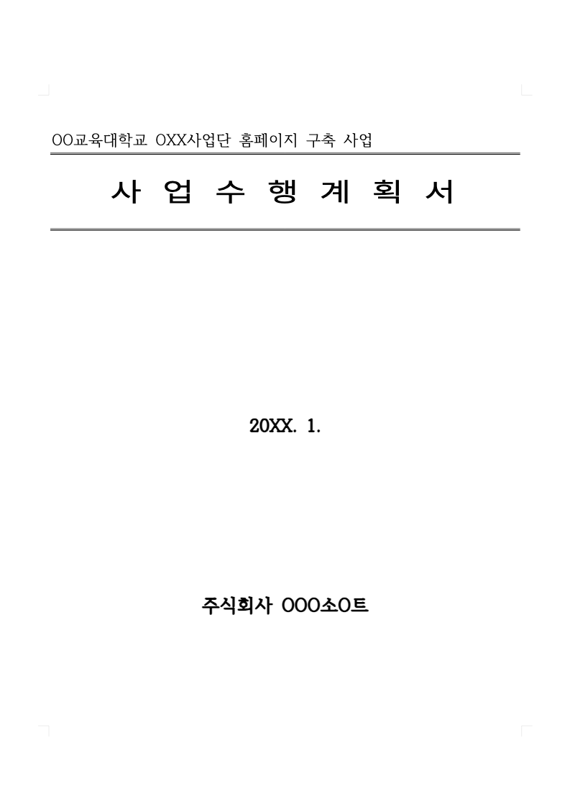
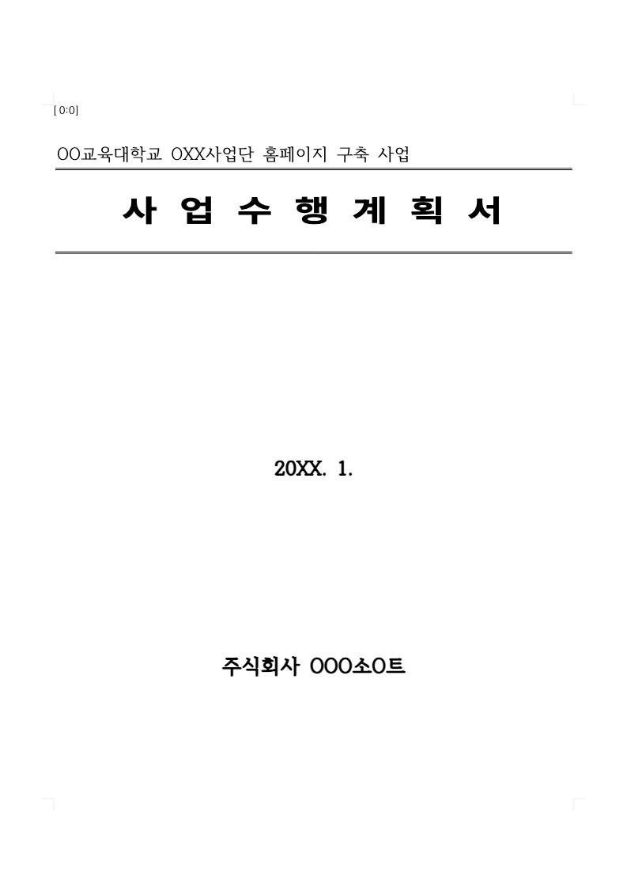

# Document preview benchmark

Measured on September 8, 2026 with fresh headless Chrome processes and the existing local WASM build. The baseline is `b44bc5ee`. The combined revision is `8c70904d`, containing the resource, typewriter, and mutation scheduler fixes. Raw measurements, browser version, and WASM digest are in [results.json](results.json).

The typewriter workload improved from a median 18.33 to 51.57 FPS during dispatch across three alternating baseline/combined runs. Including the 1.2-second settling period, median FPS improved from 41.34 to 59.18. Median dispatch time fell from 1,036 to 363 ms; caret geometry calls fell from 12,716 to 731. This workload sends 100 notifications in ten bursts against a valid range in the six-page business-plan document.

## Remaining engine cost

Each edit workload inserts 48 short strings into paragraph zero in twelve bursts of four operations. The operations use the real WASM bridge and production invalidation events. They exclude agent transport and model latency. The WASM instance processes edits serially even when the burst uses bounded Promise.all scheduling.

| Document and invalidation | Active FPS before | Active FPS combined | Edit time before | Edit time combined | Render calls before → combined |
| --- | ---: | ---: | ---: | ---: | ---: |
| Business plan, global | 22.45 | 22.60 | 1,113 ms | 1,018 ms | 16 → 13 |
| Business plan, page-local | 18.16 | 21.16 | 1,046 ms | 1,040 ms | 12 → 12 |
| 78-page KPS, global | 1.20 | 1.16 | 19,173 ms | 18,993 ms | 18 → 13 |
| 78-page KPS, page-local | 0.94 | 1.21 | 19,169 ms | 19,059 ms | 12 → 12 |

The renderer changes do not deliver 60 FPS during large-document mutation bursts. Long synchronous engine operations dominate these measurements. Timing varies with host load; correctness assertions have no absolute timing threshold.

An additional experiment wraps each four-edit burst in the raw engine's `beginBatch` and `endBatch`. On the combined revision, the 78-page workload took 6,693 ms instead of 18,993 ms, a 2.84× speedup. Active FPS rose to 3.29 and mean long-task duration fell from 1,444 to 534 ms. `endBatch` performs pagination, so the experiment does not add another `refreshLayout`. This is a benchmark-only experiment, with no production batching change in these three fixes.

The pathological giant-cell fixture was stopped after more than two minutes inside synchronous WASM work. The complete comparable suite uses the business-plan and 78-page KPS documents.

## Stale-page regression

After inserting `[0:0]`, the benchmark invalidates pages zero and one in the same burst. The baseline renders only page one and leaves page zero stale. The combined revision renders both pages. The final page-zero PNG then matches a fresh WASM render exactly.

| Before: inserted text missing | After: inserted text visible |
| --- | --- |
|  |  |

All completed combined scenarios passed exact final text and first-page pixel checks, retained visible canvases, and reported no crashes or uncaught page errors. The baseline multi-page case intentionally fails the pixel assertion. Pixel checks cover page zero; render counts verify that both invalidated visible pages were processed.

## Reproduce

Run from the repository root. The script starts and stops its own Vite server on port 7784 and always launches fresh headless Chrome. Install Studio dependencies and provide a built `rhwp/pkg` first. Set `CHROME_PATH` when Chrome is not in its standard location. When comparing worktrees, copy `rhwp/pkg` into each checkout because Vite's filesystem policy can reject WASM reached through external symlinks.

```sh
node rhwp/rhwp-studio/e2e/preview-frame-bench.mjs --label=current

BENCH_SAMPLES=biz_plan.hwp BENCH_MODES=typewriter BENCH_BURSTS=10 BENCH_BURST_SIZE=10 \
  node rhwp/rhwp-studio/e2e/preview-frame-bench.mjs --label=typewriter

BENCH_SAMPLES=biz_plan.hwp BENCH_MODES=multi-local BENCH_BURSTS=1 BENCH_BURST_SIZE=1 \
  node rhwp/rhwp-studio/e2e/preview-frame-bench.mjs --label=multi-local

BENCH_SAMPLES=kps-ai.hwp BENCH_MODES=engine-batch \
  node rhwp/rhwp-studio/e2e/preview-frame-bench.mjs --label=engine-batch
```

Set `BENCH_STUDIO_ROOT=/absolute/checkout/rhwp/rhwp-studio` to serve another revision with the same script. Results and screenshots are written under `rhwp/rhwp-studio/output/preview-frame-bench/<label>/`. Do not run competing browser benchmarks concurrently. `activeFps` counts animation callbacks during dispatch; `fps` summarizes intervals through the settling period. Long tasks use the browser PerformanceObserver API.
