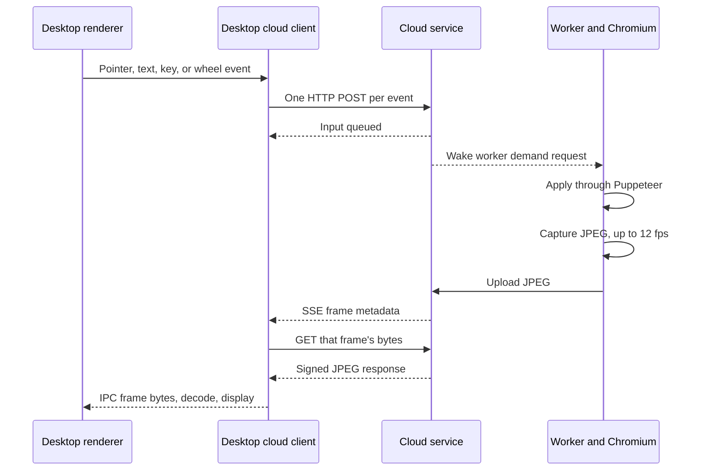

# Raucloud reliability audit

This records the original findings at `832af4f7`. The subsequent fixes and current verification are in [Raucloud reliability fixes](raucloud-reliability-fixes.md). The diagnostic script now asserts the repaired behavior.

2026-09-05. Reviewed commit `832af4f7`. Primary scope is app-hosted Raucloud in the desktop app, as reported by the user.

I would block merging the interactive cloud workspace. The code contains a shutdown policy that ignores active editing, a reproducible path that omits manual edits from saved results, and input transport that builds delay into ordinary interaction. Increasing retries alone will not address these problems.

This is a source review with local reproductions. It does not measure the user's deployed server, region, network, CPU usage, or observed disconnect frequency. Production code was not changed.

## What the editing path does



The next input POST waits for the previous POST to finish. Frames also need an HTTP download after their metadata arrives. The broker is an additional dependency for queueing agent messages and starting or completing turns.

## Findings, in fix order

### 1. P0. Manual edits after an agent turn can disappear from the result

The runtime checkpoints after successful agent tools and turns. Once a persistent session is waiting for another message, manual remote input changes Chromium's document without committing another checkpoint. Ending the session copies `latestCheckpoint.checkpointPath`. The idle takeover path also acknowledges the previously committed boundary.

**Reproduced.** A fake document engine held `MANUAL EDIT AFTER TURN`, but the real `runSession` returned a result containing `AGENT EDIT`. It exported the document only once. The fake engine isolates the lifecycle error; this was not a real HWP rendering test.

Relevant code:

- `cloud/document-runtime/run.mjs:284` handles idle takeover, pause, sleep, and finish decisions.
- `cloud/document-runtime/run.mjs:434` defines checkpoints inside the agent-turn loop.
- `cloud/document-runtime/run.mjs:580` copies the earlier checkpoint into the final result.
- `cloud/document-runtime/studio-harness.mjs:807` applies remote input directly to Chromium.

Track document revisions for manual edits. Commit dirty state independently of agent turns, and flush it before End, takeover, sleep, or planned shutdown. Tie the displayed saved state to a durable revision receipt. Serialize export with document mutations so the checkpoint and timeline describe one consistent revision.

### 2. P0. The broker shuts down an actively used editor after five minutes without another agent turn

`completeCloudRun` marks the worker `warm` and sets `warmUntil` to five minutes later. Broker reconciliation then requests teardown. Display interest, keyboard input, and the session event stream never extend this broker deadline. After turn completion, `RaucloudLeaseController` also marks its lease inactive and skips broker heartbeats.

**Reproduced.** Using the real broker and display store with a synthetic clock, renewing the viewer and submitting text every ten seconds still caused the broker to call the fake provisioner's teardown. The display store continued accepting input. No real infrastructure was created or deleted.

Relevant code:

- `rhwp/rau-credits/cloud-broker.mjs:5` sets the five-minute idle limit.
- `rhwp/rau-credits/cloud-broker.mjs:1043` starts the idle deadline after each completed turn.
- `rhwp/rau-credits/cloud-broker.mjs:363` expires warm workers.
- `rhwp/rau-credits/server.mjs:85` runs reconciliation every 30 seconds.
- `cloud/src/http-server.mjs:590` and `:610` handle display interest and input without updating the broker.

Give the workspace a lifetime separate from an agent turn. Renew workspace activity while the user edits, with a bounded disconnect grace period. Require a durable dirty-document flush before releasing compute. Keep quota enforcement explicit; extending an editing session should not silently grant unlimited compute.

### 3. P1. Every input event waits for a network round trip

`sendInput` appends each event to a promise chain and awaits the HTTP response before sending the next event. The UI coalesces pointer moves, but wheel events, text, key down, and key up enter the ordered queue individually. There is no client queue-length or age limit.

**Reproduced.** Twenty wheel events took 2,037 ms with an injected 100 ms request duration. Maximum concurrent requests was one. This is a queue measurement, not a production latency measurement.

At a 100 ms round trip, the chain handles roughly ten events per second before other costs. Scrolling can enqueue events much faster. A stalled input request can occupy the queue for the client's default 30-second timeout.

Relevant code:

- `desktop/cloud-display.mjs:274` serializes input requests.
- `desktop/cloud-client.mjs:1148` sends one event per POST with one attempt.
- `desktop/cloud-client.mjs:33` supplies the default request timeout.
- `rhwp/rhwp-studio/src/ui/cloud-workspace.ts:499` submits each wheel event.

Use an ordered persistent input connection with bounded batches and acknowledgement cursors. Coalesce wheel deltas and pointer moves without reordering clicks or key transitions. Expire obsolete interaction safely after reconnect. Simply launching concurrent POSTs would break the server's sequence handling.

### 4. P1. Frames can expire before their download request reaches the server

The server retains only two JPEGs. The desktop first receives metadata, then requests the named frame. At continuous 12 fps, a newly published frame leaves the store after about 167 ms. Metadata delivery plus the returning GET consumes approximately one network round trip before download begins. A connection above that delay can repeatedly request frames that have already been removed.

The client silently skips `DISPLAY_FRAME_NOT_FOUND`. It has no fallback to fetch the newest available frame with its matching metadata. One in-flight frame download also limits the effective frame rate on slower links.

Relevant code:

- `cloud/src/display-frame-store.mjs:256` keeps two frames; `:265` rejects missing sequences.
- `desktop/cloud-display.mjs:439` downloads sequentially and skips missing frames.
- `cloud/document-runtime/session-frame-publisher.mjs:307` captures at fixed 12 fps and fixed JPEG quality.

This is a timing inference from the transport, not a measured production frame-loss rate. Send frame metadata and bytes together, or provide an atomic latest-frame response. Adapt capture rate, resolution, and quality to measured delivery capacity. Retention should be bounded by bytes and expected transit time, not only frame count.

### 5. P1. Broker trouble can stop a healthy document worker

The worker's local heartbeat endpoint waits for a broker request. The lease controller sets `mustStop` after three failed broker heartbeats, and the worker calls `process.exit(1)` on that response. A local worker can therefore terminate because a separate service is unreachable.

Broker calls also sit before message acceptance and turn start, and after local turn completion. In the latter case, the session store has already completed the turn when broker reporting can fail. The runtime then receives an error for an operation that locally succeeded.

Relevant code:

- `cloud/src/raucloud-lease.mjs:148` turns repeated broker errors into `mustStop`.
- `cloud/worker/main.mjs:22` exits on that signal.
- `cloud/src/http-server.mjs:251`, `:454`, `:462`, and `:718` await broker calls.
- `cloud/src/raucloud-lease.mjs:37` gives broker requests a 30-second timeout.

Separate local health from broker availability. Use a bounded, authenticated lease that the worker can enforce locally, and persist billing/lifecycle reports for retry with operation IDs. An explicit revocation must still stop work. A transient broker outage should enter a defined grace state and save before expiry.

### 6. P1. Reconnect can give up, miss a frozen stream, or replace the workspace

The display stops after a fixed retry budget, defaulting to twelve. The renderer shows an unavailable state and has no dedicated retry timer there; reopening depends on another context update or user action. The desktop's broader watchdog probes only while its link state is `ready`. Failed health recovery changes that state to `failed`.

More seriously, repeated app-hosted recovery attempts can call `recreateCloud`. That calls account force-quit, ends live sessions, and abandons handoffs before spawning a replacement. Failing a health check does not establish that the old workspace is irrecoverable.

There is also no explicit SSE receive-idle watchdog. A stuck display stream can remain open while interest renewal and `/health` still succeed. Static documents require a stream heartbeat check, not a requirement that screenshots continually change.

Relevant code:

- `desktop/cloud-display.mjs:231`, `:326`, and `:354` enforce retry exhaustion.
- `desktop/cloud-client.mjs:1182` and `:1207` read SSE without a receive deadline.
- `desktop/cloud-coordinator.mjs:854`, `:927`, `:939`, `:950`, and `:1650` implement health recovery and recreation.
- `rhwp/rhwp-studio/src/ui/cloud-workspace.ts:418` closes a failed display.

Use one workspace connection state machine, with separate health signals for broker, server, worker, display, and document sync. Retry transient disconnects while the workspace remains selected. Wake immediately on network restoration or resume. Require evidence of workspace loss and a verified recovery checkpoint before replacement.

### 7. P1. Chat updates wait behind document exports and checkpoint downloads

The worker drains Chromium events every 200 ms. It forwards each event through an awaited HTTP request. After every successful root tool result, including successful reads, it awaits a full document export, document upload, timeline export/upload, and boundary commit before continuing to drain events.

The desktop similarly awaits checkpoint mirroring and timeline downloads inside its SSE event handler. Later chat and state events cannot pass that handler. A mirror failure throws into the stream reconnect path, and the reconnect hook attempts mirroring before reopening the stream.

Relevant code:

- `cloud/document-runtime/studio-harness.mjs:723`, `:736`, `:750`, and `:775` serialize event draining and checkpoint work.
- `cloud/document-runtime/run.mjs:434` exports and uploads the full artifacts.
- `desktop/cloud-client.mjs:1452` awaits each event handler.
- `desktop/cloud-coordinator.mjs:2505`, `:2603`, and `:2618` put artifact synchronization in that handler.

Separate event delivery from artifact transfer. Batch live events and schedule checkpoint mirroring with a durable pending revision. Checkpoint document changes rather than every successful tool. Preserve atomic document/timeline boundaries, and flush required changes before ownership transitions.

### 8. P1. A recovered idle session can wait for a message before starting its editor

For a session with a stable recovery checkpoint, `runSession` calls `awaitConversationInput` before creating Chromium. A persistent idle session can remain there until another message or control action arrives. Reopening a document to read or manually edit it does not itself start the editor.

Relevant code is `cloud/document-runtime/run.mjs:337`, `:355`, and `:379`. Restore document viewing and editing on workspace attachment. Start agent execution separately when a message arrives.

### 9. P1. Input acceptance does not confirm application, and failures can silently discard edits

The public input response confirms queue insertion. The worker catches errors applying input, emits `display-input-failed`, then advances its demand cursor anyway. The next demand request removes those events. The desktop shows control as active after queue acceptance, without waiting for the worker to apply the event.

Relevant code:

- `cloud/src/display-frame-store.mjs:364` acknowledges acceptance; `:381` removes cursor-acknowledged events.
- `cloud/document-runtime/session-frame-publisher.mjs:235` catches input errors and advances the cursor.
- `rhwp/rhwp-studio/src/ui/cloud-workspace.ts:193` sets active control after acceptance.

Distinguish queued, applied, and saved acknowledgements. Surface rejected text and preserve it for deliberate recovery. Do not blindly replay an ambiguous click or destructive shortcut. Use explicit input reset and resynchronization after partial failures.

### 10. P2. The current claims and tests overstate what has been established

The design says the 12 fps JPEG tradeoff buys low interaction latency, but provides no latency distribution or network conditions. It calls worker publishing latest-wins, although `session-frame-publisher.mjs:516` retries the current stale frame while a newer frame waits. The UI can also label a retained frame live before any new frame has arrived after reconnect.

Relevant code is `docs/local-cloud-workspace-design.md:177` and `:200`, `cloud/document-runtime/session-frame-publisher.mjs:516`, and `rhwp/rhwp-studio/src/ui/cloud-workspace.ts:408`.

Replace claims with measured conditions and explicit limits. Add frame age, input queue age, applied-input cursor, saved revision, reconnect reason, and per-stage timings. Test the interaction between the broker and workspace, not only each module's intended state transitions.

## Architecture recommendation

The target needs a distinction. Cursor documents both cloud agents with remote desktop control and Remote SSH workflows. A screenshot workspace can support the former. A local editor attached to a remote environment is the closer reference for native editing responsiveness. See [Cursor Cloud Agents](https://cursor.com/docs/cloud-agent) and [VS Code Remote Development](https://code.visualstudio.com/docs/remote/remote-overview).

For Rauhwpx, I recommend keeping document rendering, caret, selection, scrolling, and IME in the local Studio editor, with cloud agent execution and versioned document changes synchronized through an ordered protocol. Keep the remote desktop available for inspecting the agent's environment. This requires an explicit document authority and conflict policy. Removing the current read-only lease alone would allow competing writers.

If full remote desktop editing is the intended product, retain server ownership but replace the per-event and per-frame request pipeline with a transport designed for interactive input and adaptive media delivery. Benchmark that path before committing to a codec or protocol. Raising the JPEG frame rate without fixing transit time and queueing can increase load while making expiry worse.

In either design, workspace lifetime, agent-turn lifetime, and billable allocation must have separate state and clear ownership.

## Work sequence and release checks

1. Fix manual-edit persistence and activity-aware workspace lifetime. Reproduce End, takeover, worker loss, and broker expiry with edits made after an agent turn.
2. Replace destructive network recovery with workspace reattachment. Add bounded broker-outage behavior and explicit transport liveness checks.
3. Remove input round-trip serialization and checkpoint work from event delivery. Measure before choosing the longer-term editing transport.
4. Add a desktop hosted-session test that runs across turn completion, five-minute idle expiry, credential refresh, sleep/wake, and document recovery.

Suggested acceptance checks, not measured results:

| Scenario | Required outcome |
| --- | --- |
| Edit for 30 minutes without sending another agent message | No idle teardown; all saved revisions survive reopening |
| Manual edit, then End or takeover | Returned document includes that edit |
| Network interruption for 5 seconds, 60 seconds, and 10 minutes | Same workspace reattaches while retained; no automatic force-quit based only on failed probes |
| Broker unavailable while server remains reachable | Document remains recoverable; locally enforced lease/grace behavior is visible |
| 20, 100, and 200 ms RTT with bandwidth limits and jitter | Report input-to-application and input-to-visible p50/p95/p99, queue age, frame age, and frame misses |
| Continuous scrolling and Korean IME input | No queue growth, reordered key transitions, lost composition, or stuck modifiers |
| Large document and reference set during checkpoint export | Chat remains responsive; ownership transitions still wait for a consistent saved revision |
| Two-hour hosted desktop session | Report every reconnect with its actual cause; verify final document and timeline |

## Verification performed

On Node.js `v26.7.0`, 131 targeted existing tests passed, with zero failures or skips:

```sh
node --test \
  tests/desktop-cloud-display.test.mjs \
  tests/desktop-cloud-connection-reliability.test.mjs \
  tests/desktop-cloud-client-reliability.test.mjs \
  tests/desktop-cloud-broker.test.mjs \
  cloud/tests/raucloud-lease.test.mjs \
  cloud/tests/document-runtime.test.mjs \
  cloud/tests/display-frame-store.test.mjs \
  cloud/tests/session-frame-publisher.test.mjs
```

The three additional reproductions are saved in [raucloud-reliability-probes.mjs](diagnostics/raucloud-reliability-probes.mjs). Run from the repository root:

```sh
node docs/diagnostics/raucloud-reliability-probes.mjs
```

These diagnostics assert the current problematic behavior. Their success means the problem reproduced, not that the feature passed a release check. They use injected latency, a fake provisioner, and a fake document engine. They call real queue, broker, display-store, and runtime code and make no external requests.

No live hosted session, UI smoke test, infrastructure inspection, or production latency benchmark was run. The deployed revision and actual causes of the user's observed incidents still need correlation with logs.
