# Document editing fidelity visual evidence

These comparisons use independent Studio and WASM builds from baseline `c69ad4a6` and this branch. Each pair runs the same representative document or editor interaction. The table and caret callouts report the actual runtime target dimensions and cursor path after the operation.

| Fix | Before and after |
| --- | --- |
| Letter spacing preserves glyph proportions | 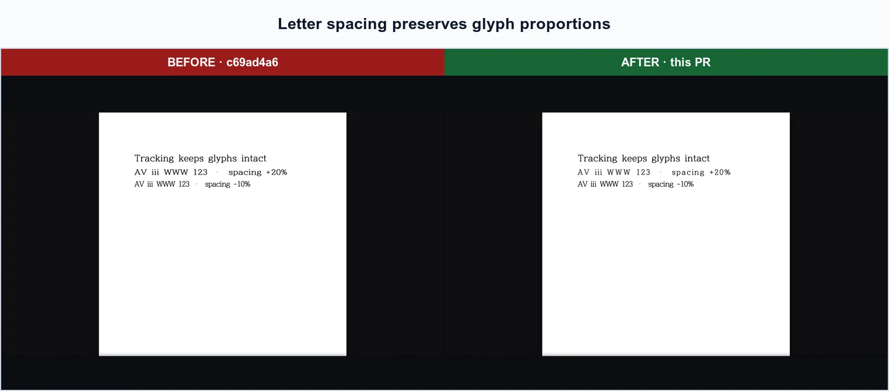 |
| Exact-face shaping preserves kerning and ligatures | 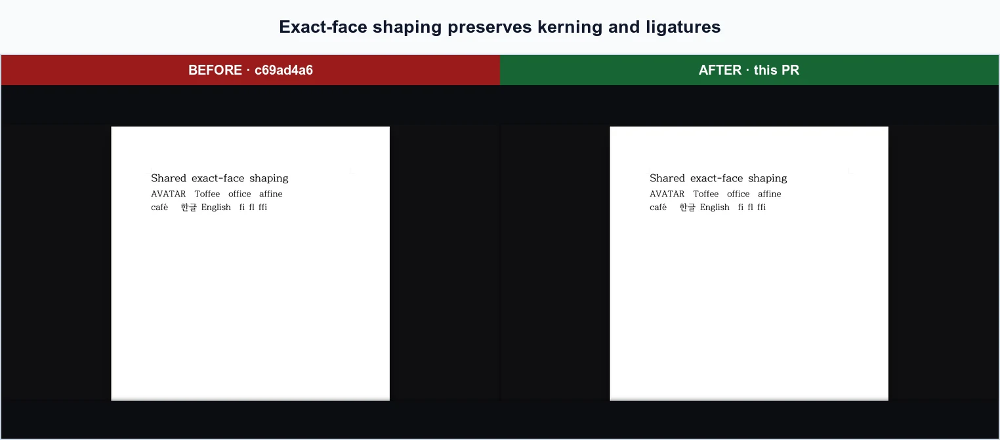 |
| Nested table commands edit the selected table | 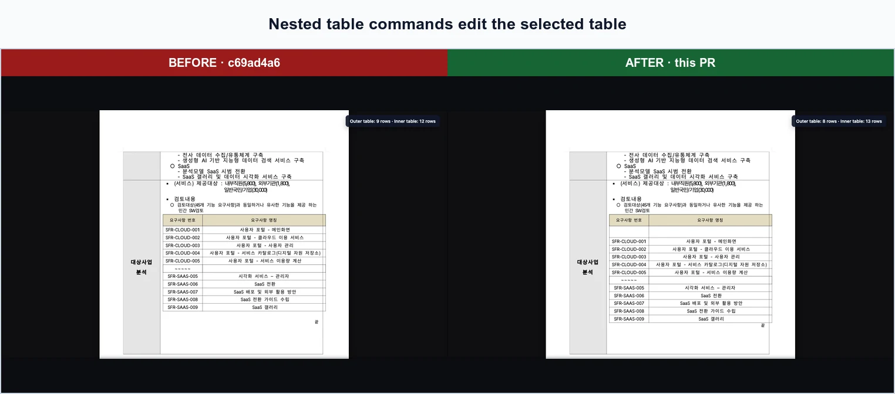 |
| Structural edits remap the full caret path | 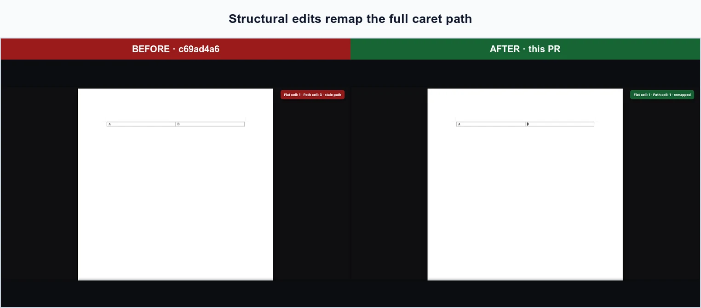 |
| Equation properties target the selected equation | 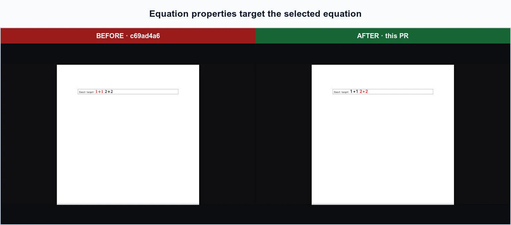 |
| Equation text uses the saved face and measured widths | 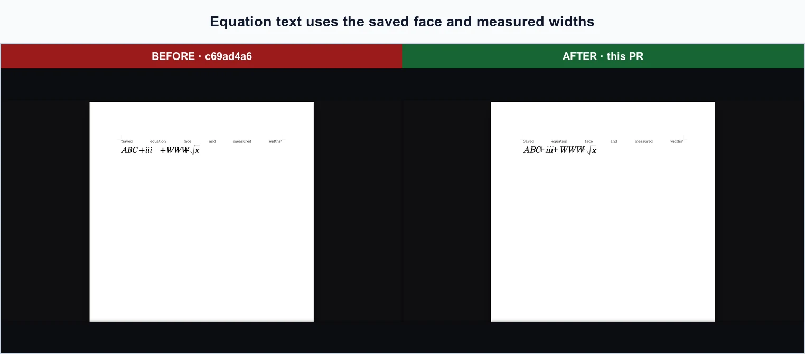 |
| Literal underscores and hyphens stay text | 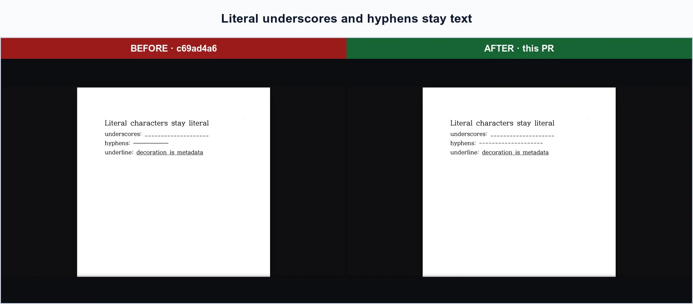 |
| Advanced table borders remain visually distinct | 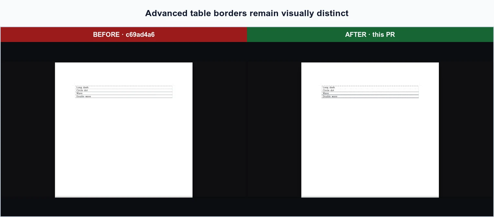 |
| Underline and strikeout styles survive the dialog | 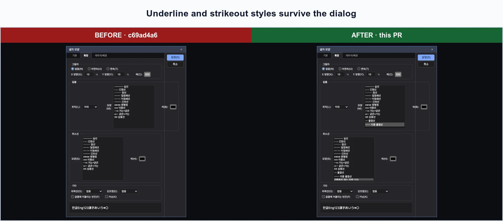 |
| Equation parse failures are visible and actionable | 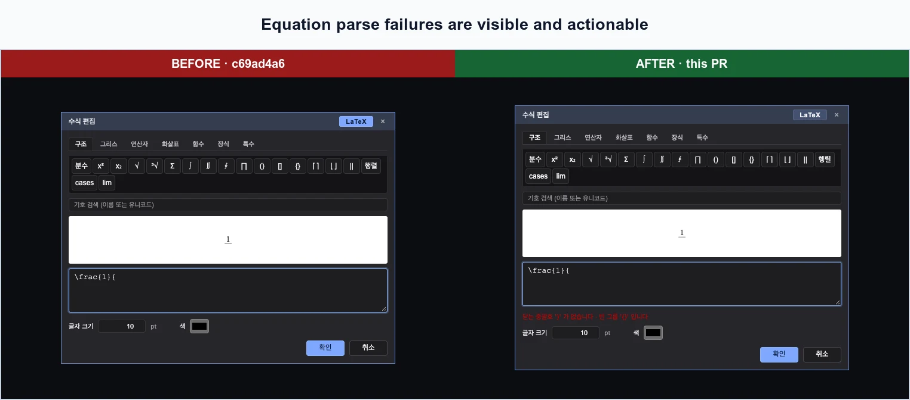 |
| Images, equations, tables, and ranges can be sent to agents | 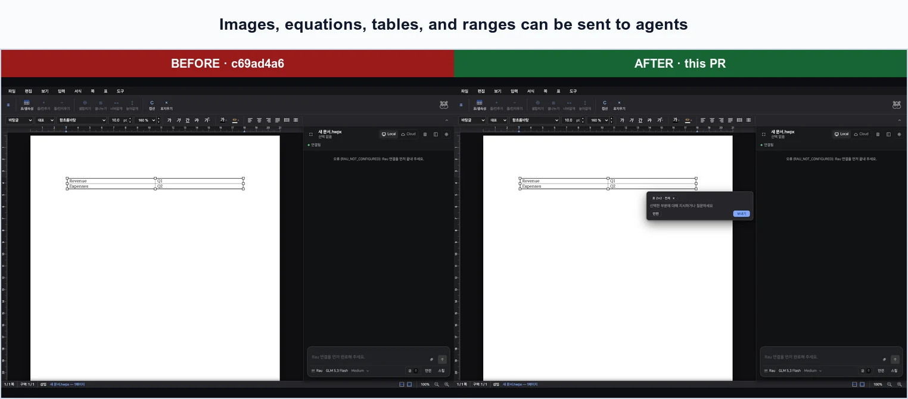 |

These images are review evidence only. Visual comparisons remain outside CI.
