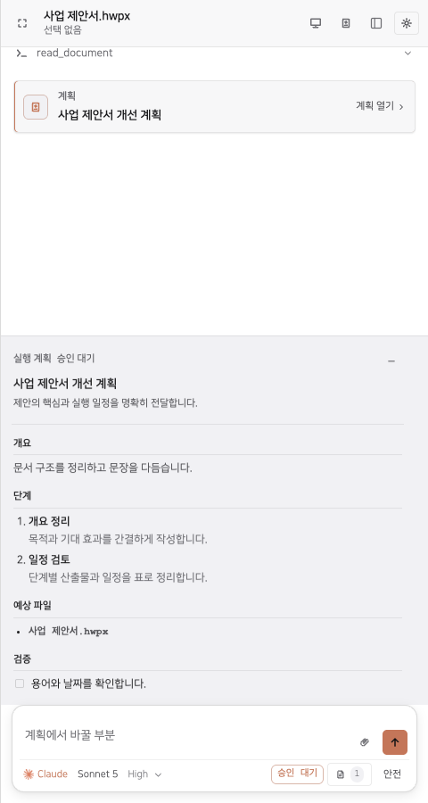
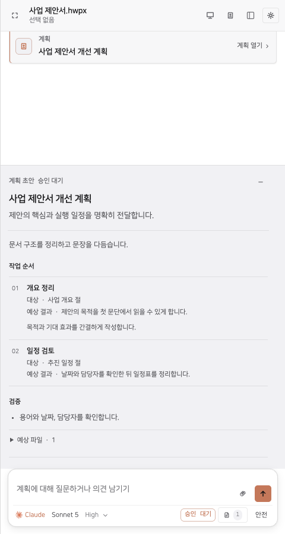

# Plan mode

The agent researches and discusses the document in chat. **계획 초안 작성** turns that conversation into a reviewable sheet. Questions leave the sheet available; concrete feedback produces a new version with a change summary. The sheet shows affected document sections, proposed results, supporting sources, and validation, with secondary details behind disclosures.

**문서에 적용** approves the displayed version after checking the live document revision. The agent updates each checklist step as it starts, completes, or becomes blocked. Safe-mode edits remain **검토 대기** until accepted. Rejected, failed, and interrupted work cannot mark the plan complete. Reconnecting preserves the authoritative checklist and pending review.

| Before | After |
| --- | --- |
|  |  |

- [Before interaction recording](before.webm)
- [After interaction recording](after.webm)
- [Revised plan](after-revised.png)
- [Sources and approval](plan-actions.png)
- [Execution checklist](plan-running.png)
- [Narrow dark appearance](plan-narrow-dark.png)

Captured from the standalone sidebar preview, which mounts the production sidebar with local provider and document fixtures. These recordings demonstrate UI behavior; hub integration tests exercise the actual workflow, permission, revision, and reconnect protocol separately. No live provider credentials or document engine were used for the captures.
